# TCP Congestion Control

TCP congestion control 的目標是讓 sender 不要一次把太多資料塞進網路，避免 queue 塞爆、封包大量遺失，甚至造成 congestion collapse。TCP sender 主要用 `cwnd`（congestion window）限制「已送出但尚未被 ACK 確認」的資料量，再依照 ACK、loss、RTT 或 ECN mark 調整傳送速率。

RFC 5681 把傳統 TCP congestion control 拆成四個核心機制：slow start、congestion avoidance、fast retransmit、fast recovery。後來的 Tahoe、Reno、NewReno、CUBIC、BBR 等方案，基本上都是在「如何判斷壅塞」與「壅塞後 cwnd 怎麼調」上做不同設計。

## 1. Slow Start + AIMD

Slow Start 是 TCP 開始傳輸或 timeout 後常見的起步方式。sender 一開始用小 `cwnd`，每收到 ACK 就增加 window，所以每個 RTT 大致呈倍數成長。當 `cwnd` 到達 `ssthresh` 後，進入 congestion avoidance，改用 AIMD（Additive Increase, Multiplicative Decrease）：平常慢慢加，偵測到壅塞就大幅降。

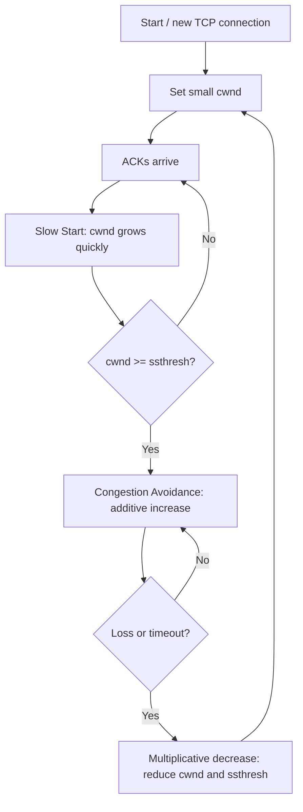

重點：

- 優點：簡單、保守，能避免一開始就塞爆網路。
- 缺點：短連線可能還沒離開 slow start 就結束；loss-based 判斷也可能把無線錯誤或 packet reordering 誤認成壅塞。
- 參考來源：[RFC 5681: TCP Congestion Control](https://www.rfc-editor.org/info/rfc5681)

## 2. TCP Tahoe

Tahoe 是早期 loss-based TCP。它有 slow start、congestion avoidance、fast retransmit；當收到 3 個 duplicate ACK 時，會先快速重傳疑似遺失的 segment，但接著把 `cwnd` 降回很小，重新 slow start。

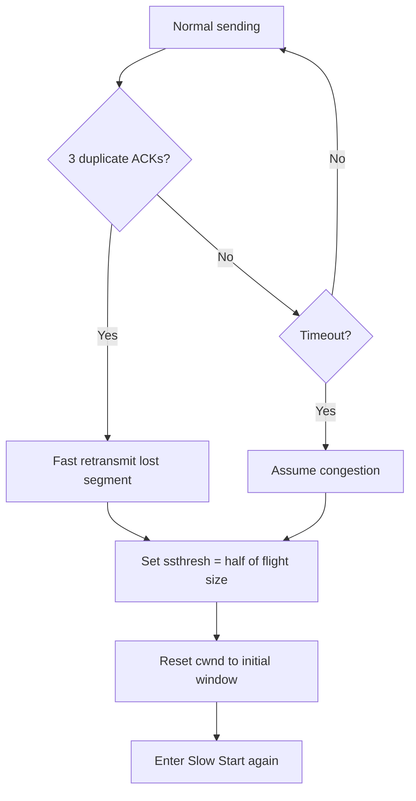

重點：

- 優點：遇到 loss 時反應保守，能快速降低壅塞風險。
- 缺點：每次 loss 後都回 slow start，吞吐量恢復較慢，尤其在高頻寬高延遲網路會很吃虧。
- 參考來源：[RFC 5681](https://www.rfc-editor.org/info/rfc5681)、[Fall and Floyd, Simulation-based Comparisons of Tahoe, Reno and SACK TCP](https://www.icir.org/floyd/papers/sacks.pdf)

## 3. TCP Reno

Reno 在 Tahoe 基礎上加入 fast recovery。收到 3 個 duplicate ACK 時，它仍會 fast retransmit，但不直接把 `cwnd` 打回初始值，而是約減半後進入 fast recovery。這讓 TCP 在單一封包遺失時可以比較快恢復傳輸。

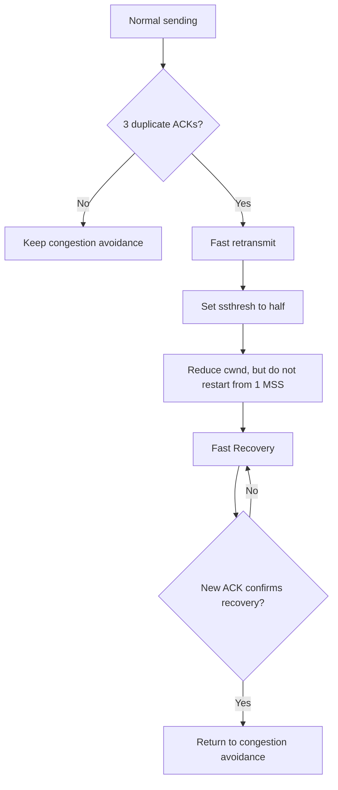

重點：

- 優點：比 Tahoe 更快恢復，對單一 packet loss 表現較好。
- 缺點：一個 window 內有多個 loss 時，Reno 的 cumulative ACK 可能不夠精準，恢復效率會變差。
- 參考來源：[RFC 5681](https://www.rfc-editor.org/info/rfc5681)、[Fall and Floyd paper](https://www.icir.org/floyd/papers/sacks.pdf)

## 4. TCP NewReno

NewReno 改良 Reno 的 fast recovery，特別針對「同一個 window 內多個封包遺失」的情境。它會用 partial ACK 判斷還有其他遺失資料，持續留在 fast recovery，而不是太早回到 congestion avoidance。

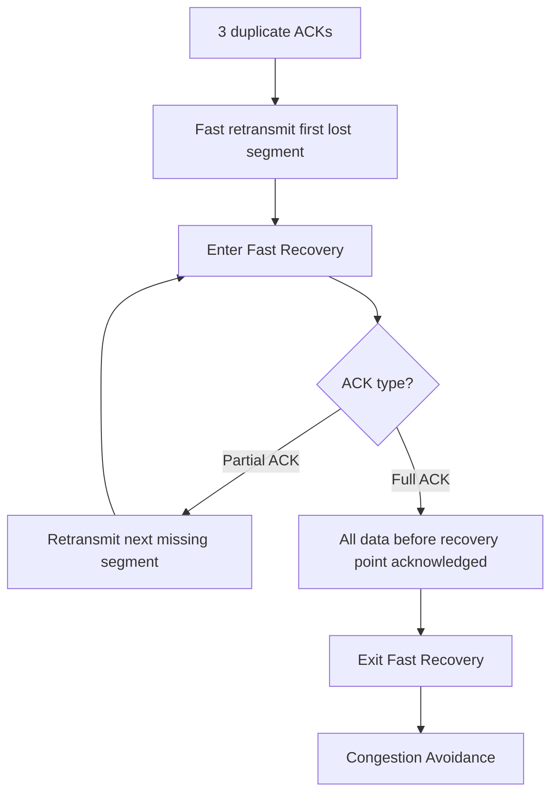

重點：

- 優點：不需要 SACK option 也能比 Reno 更好處理多重 loss。
- 缺點：仍然不如 SACK 精準，因為 sender 只能從 partial ACK 推測哪些 segment 遺失。
- 參考來源：[RFC 6582: The NewReno Modification to TCP's Fast Recovery Algorithm](https://www.rfc-editor.org/info/rfc6582)

## 5. SACK-based Loss Recovery

SACK（Selective Acknowledgment）不是一個完整的 congestion control algorithm，而是一個 TCP option / loss recovery 解決方案。傳統 cumulative ACK 只能說「到哪裡以前都收到了」；SACK 可以額外告訴 sender「哪些不連續區段已經收到」，讓 sender 只重傳真正遺失的資料。

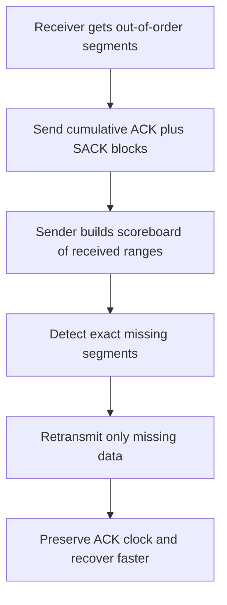

重點：

- 優點：多重 packet loss 時比 Reno/NewReno 更有效率，避免重傳已成功收到的資料。
- 缺點：需要兩端支援 SACK option；它解決 loss recovery 精準度，不直接取代 cwnd 控制邏輯。
- 參考來源：[RFC 2018: TCP Selective Acknowledgment Options](https://www.rfc-editor.org/info/rfc2018)、[RFC 3517: SACK-based Loss Recovery Algorithm for TCP](https://www.rfc-editor.org/info/rfc3517)

## 6. TCP Vegas

Vegas 是 delay-based congestion control。它不等到 packet loss 才反應，而是觀察 RTT 上升。當實際 throughput 低於預期、代表 queue 可能開始累積時，Vegas 就提早降低或放慢 `cwnd` 成長。

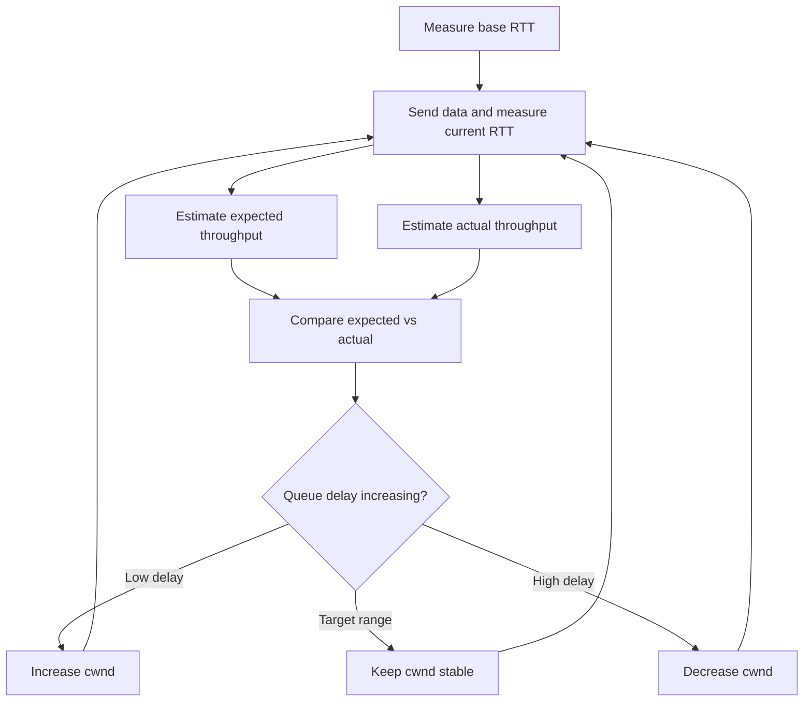

重點：

- 優點：能在 loss 發生前偵測壅塞，通常能降低 queueing delay。
- 缺點：和 loss-based TCP 共存時可能偏保守，因為 Reno/CUBIC 會把 queue 推得更滿。
- 參考來源：[Brakmo and Peterson, TCP Vegas: End to End Congestion Avoidance on a Global Internet](https://www.cs.arizona.edu/projects/protocols/publications/vegas.pdf)

## 7. TCP CUBIC

CUBIC 是現代作業系統常見的預設 TCP congestion control。它用「距離上次 loss 經過的時間」套三次方函數來調整 `cwnd`，在接近上次 loss 前的 window 時比較謹慎，超過後再加快 probing。這比傳統線性 AIMD 更適合 fast and long-distance networks。

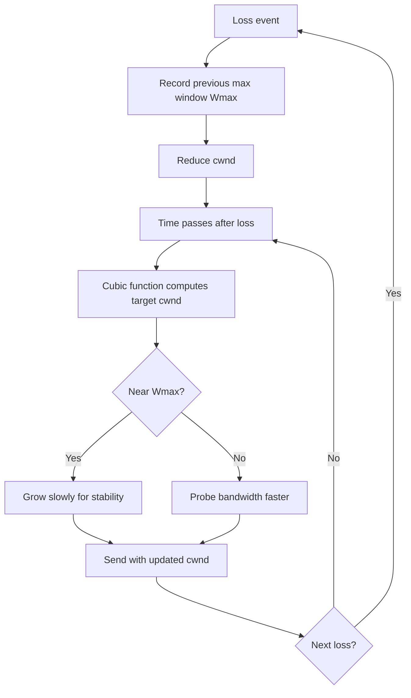

重點：

- 優點：在高頻寬、高延遲環境比 Reno 類線性成長更能有效利用頻寬。
- 缺點：仍是 loss-based，通常要等 loss 或 ECN 才明確降速，可能造成較大的 queueing delay。
- 參考來源：[RFC 9438: CUBIC for Fast and Long-Distance Networks](https://www.rfc-editor.org/info/rfc9438)

## 8. BBR

BBR（Bottleneck Bandwidth and Round-trip propagation time）是 Google 提出的 model-based congestion control。它不以 loss 作為主要壅塞訊號，而是估計 bottleneck bandwidth 與最小 RTT，建立網路路徑模型，再用 pacing rate 控制送出速度。

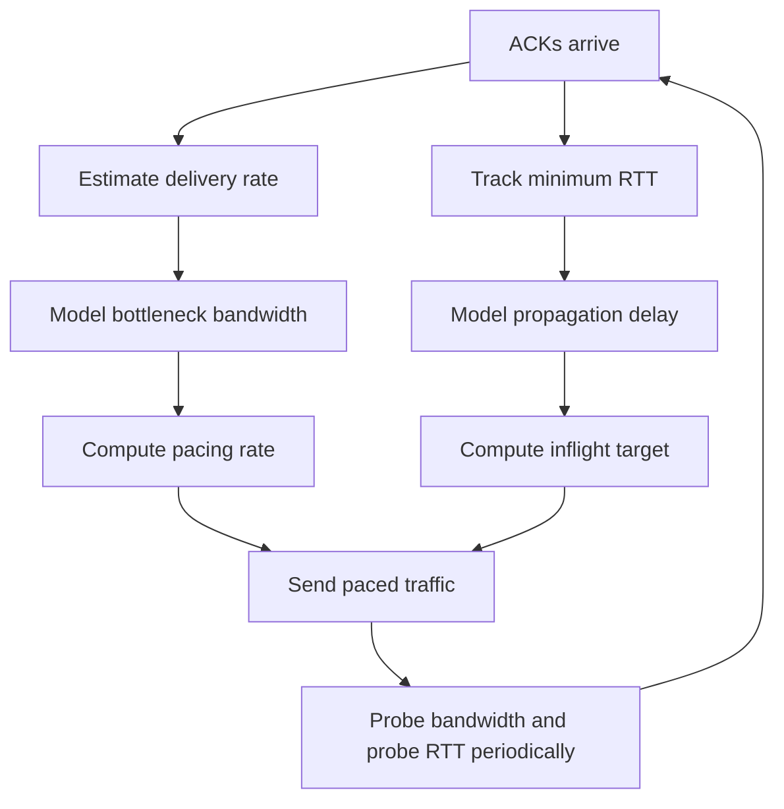

重點：

- 優點：目標是接近 bottleneck bandwidth，同時避免長時間填滿 buffer，可降低 bufferbloat。
- 缺點：BBRv1 與 loss-based flows 的公平性曾被討論；部署時通常要看網路環境與 kernel 支援。
- 參考來源：[Cardwell et al., BBR: Congestion-Based Congestion Control](https://research.google.com/pubs/pub45646.html)、[ACM Queue article](https://queue.acm.org/detail.cfm?id=3022184)

## 9. ECN

ECN（Explicit Congestion Notification）是一種「不用丟包也能通知壅塞」的解決方案。當 router / switch 的 queue 開始壅塞時，可以把 IP header 的 ECN field 標成 CE（Congestion Experienced），receiver 再用 TCP ECE flag 回報 sender，sender 收到後像遇到 loss 一樣降低傳輸速率。

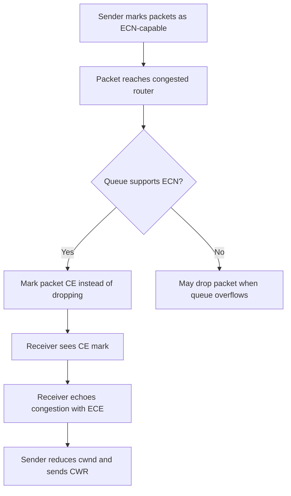

重點：

- 優點：可以提早通知壅塞，減少 packet loss、retransmission、latency 和 jitter。
- 缺點：需要 endpoints 與中間設備支援；若網路設備不正確處理 ECN，可能造成相容性問題。
- 參考來源：[RFC 3168: The Addition of ECN to IP](https://www.rfc-editor.org/info/rfc3168)、[RFC 8087: Benefits of ECN](https://www.rfc-editor.org/info/rfc8087)

## 10. DCTCP

DCTCP（Data Center TCP）是資料中心用的 congestion control。它建立在 ECN 上，但不只是知道「有沒有壅塞」，而是估計「有多少比例的 bytes 遇到 congestion mark」，再依比例調整 `cwnd`。這適合資料中心低延遲、高頻寬、淺 buffer 的環境。

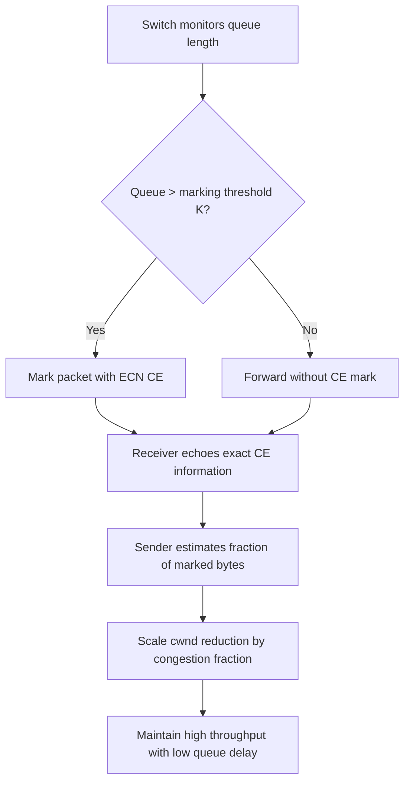

重點：

- 優點：資料中心內可同時追求 high throughput、low latency、burst tolerance。
- 缺點：RFC 明確說 DCTCP 適合 controlled environments，例如 data centers；沒有額外措施時不應直接部署到 public Internet。
- 參考來源：[RFC 8257: Data Center TCP](https://www.rfc-editor.org/info/rfc8257)、[Linux kernel DCTCP documentation](https://docs.kernel.org/networking/dctcp.html)

## Quick Comparison

| 方案 | 主要訊號 | 主要想解決的問題 | 適合場景 |
| --- | --- | --- | --- |
| Slow Start + AIMD | ACK / loss | TCP 基本壅塞避免 | 一般 TCP 基礎機制 |
| Tahoe | loss / duplicate ACK | 保守避免壅塞 | 早期 TCP、教學理解 |
| Reno | loss / duplicate ACK | 單一 loss 後快速恢復 | 傳統網路 |
| NewReno | partial ACK | 多重 loss 的 fast recovery | 未使用 SACK 時 |
| SACK | selective ACK blocks | 精準重傳遺失 segment | 多重 loss、高 BDP path |
| Vegas | RTT / delay | 在 loss 前提早偵測壅塞 | 低延遲需求、研究/特定部署 |
| CUBIC | loss / time since loss | 高速長距離網路吞吐量 | 現代一般 OS 預設常見 |
| BBR | bandwidth + RTT model | 降低 bufferbloat、提高吞吐 | 高吞吐、可調 kernel/QUIC 場景 |
| ECN | router CE mark | 不靠丟包也能通知壅塞 | 支援 ECN/AQM 的網路 |
| DCTCP | ECN marking fraction | 資料中心低延遲高吞吐 | controlled data center |

## References

1. RFC 5681, TCP Congestion Control: <https://www.rfc-editor.org/info/rfc5681>
2. RFC 6582, The NewReno Modification to TCP's Fast Recovery Algorithm: <https://www.rfc-editor.org/info/rfc6582>
3. RFC 2018, TCP Selective Acknowledgment Options: <https://www.rfc-editor.org/info/rfc2018>
4. RFC 3517, A Conservative SACK-based Loss Recovery Algorithm for TCP: <https://www.rfc-editor.org/info/rfc3517>
5. RFC 9438, CUBIC for Fast and Long-Distance Networks: <https://www.rfc-editor.org/info/rfc9438>
6. RFC 3168, The Addition of Explicit Congestion Notification to IP: <https://www.rfc-editor.org/info/rfc3168>
7. RFC 8087, The Benefits of Using Explicit Congestion Notification: <https://www.rfc-editor.org/info/rfc8087>
8. RFC 8257, Data Center TCP: <https://www.rfc-editor.org/info/rfc8257>
9. Fall and Floyd, Simulation-based Comparisons of Tahoe, Reno and SACK TCP: <https://www.icir.org/floyd/papers/sacks.pdf>
10. Brakmo and Peterson, TCP Vegas: End to End Congestion Avoidance on a Global Internet: <https://www.cs.arizona.edu/projects/protocols/publications/vegas.pdf>
11. Cardwell et al., BBR: Congestion-Based Congestion Control: <https://research.google.com/pubs/pub45646.html>
12. ACM Queue, BBR: Congestion-Based Congestion Control: <https://queue.acm.org/detail.cfm?id=3022184>
13. Linux kernel documentation, DCTCP: <https://docs.kernel.org/networking/dctcp.html>

---

## User-space Congestion Control / Rate Control

在 Go `net.Conn` 的一般 TCP socket 程式中，真正的 TCP congestion control 通常由 OS kernel 負責。應用程式會呼叫 `Read` / `Write`，但不會直接看到或控制 TCP 內部的 `cwnd`、ACK、duplicate ACK、RTT estimator、fast recovery 等狀態。

因此，若作業使用 TCP socket 實作 multi-connection echo server，主要要處理的是「多個 client connection 如何同時被 server 接受與處理」，而不是自己實作 TCP congestion control。典型作法是每個 accepted connection 交給一個 goroutine：

```go
for {
    conn, err := listener.Accept()
    if err != nil {
        continue
    }
    go handler(conn)
}
```

不過，仍然存在一些不完全位於 kernel TCP 層級的 congestion control 或 rate control 方案。

## 11. QUIC Congestion Control

QUIC 跑在 UDP 上，像 HTTP/3 就是建立在 QUIC 之上。因為 UDP 本身沒有 TCP 的 congestion control，所以 QUIC stack 通常在 user space 實作 congestion control，例如 Reno-like、CUBIC 或 BBR 類型的控制器。

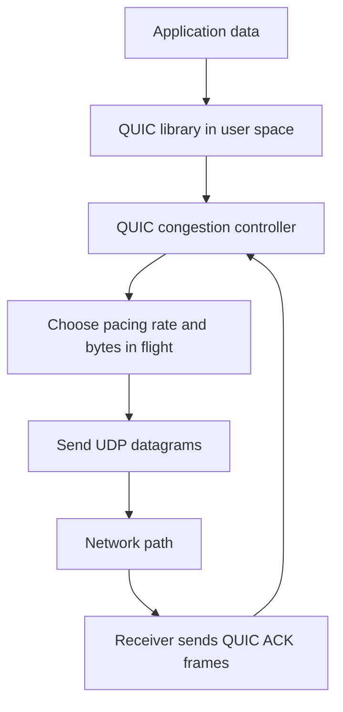

重點：

- 優點：CC 邏輯在 user space，部署與更新比 kernel TCP 彈性高。
- 缺點：要使用 QUIC/UDP stack，不能只靠一般 TCP `net.Conn` 直接控制。
- 適合場景：HTTP/3、低延遲應用、需要快速演進傳輸層策略的系統。
- 參考來源：[RFC 9000: QUIC](https://www.rfc-editor.org/info/rfc9000)、[RFC 9002: QUIC Loss Detection and Congestion Control](https://www.rfc-editor.org/info/rfc9002)

## 12. Application-level Token Bucket Rate Limiting

Token bucket 是應用層常見的 rate control。它不是真正的 TCP congestion control，因為它不根據 TCP ACK 或 `cwnd` 調整；但它可以限制 server 對每個 connection 或所有 connections 的輸出速率，避免 application 一次寫太快。

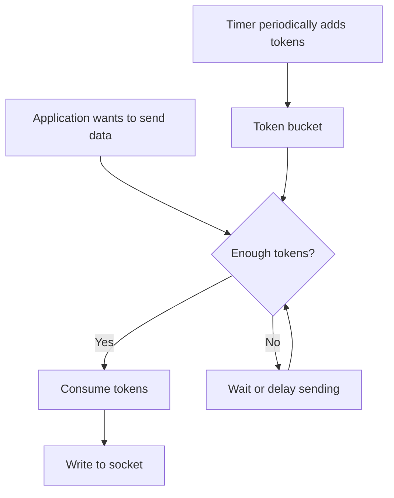

重點：

- 優點：簡單、可在 Go app 內自己實作，適合限制每條 connection 或全域頻寬。
- 缺點：不知道網路真實壅塞狀態，只是控制應用程式送資料的節奏。
- 適合場景：API server 限流、多 client fairness、避免單一連線吃光 server 資源。
- 參考來源：[RFC 3290, Appendix A: Token Bucket](https://www.rfc-editor.org/rfc/rfc3290.html#appendix-A)、[Linux Traffic Control Token Bucket Filter documentation](https://man7.org/linux/man-pages/man8/tc-tbf.8.html)

## 13. Reliable UDP / Custom Transport

另一種方式是直接用 UDP 自己做可靠傳輸：自己定義 sequence number、ACK、retransmission、RTT estimation、bytes in flight，然後在 user space 實作 congestion window 或 pacing。這比較像是在應用層重做一個簡化版 TCP/QUIC。

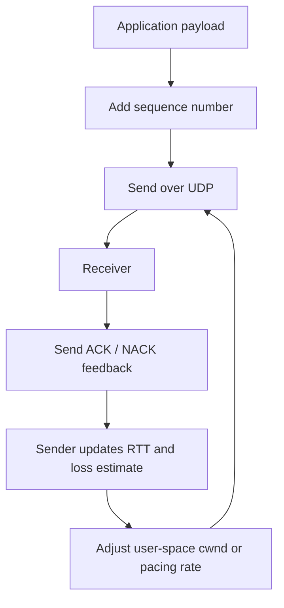

重點：

- 優點：可以完整觀察與控制 congestion control 行為，很適合教學或研究。
- 缺點：工程量大，必須處理 loss、reordering、timeout、flow control、公平性與安全性。
- 適合場景：課程實驗、特殊傳輸需求、研究型 protocol。
- 參考來源：[RFC 9002: QUIC Loss Detection and Congestion Control](https://www.rfc-editor.org/info/rfc9002)、[RFC 8085: UDP Usage Guidelines](https://www.rfc-editor.org/info/rfc8085)

## 14. WebRTC Congestion Control

WebRTC 的即時影音傳輸通常會根據 receiver feedback、packet loss、delay、jitter 等訊號估計可用頻寬，然後動態調整 video/audio bitrate。這類控制多半在 user space 的 media stack 中完成，目標不是最大吞吐量，而是維持即時性與可接受畫質。

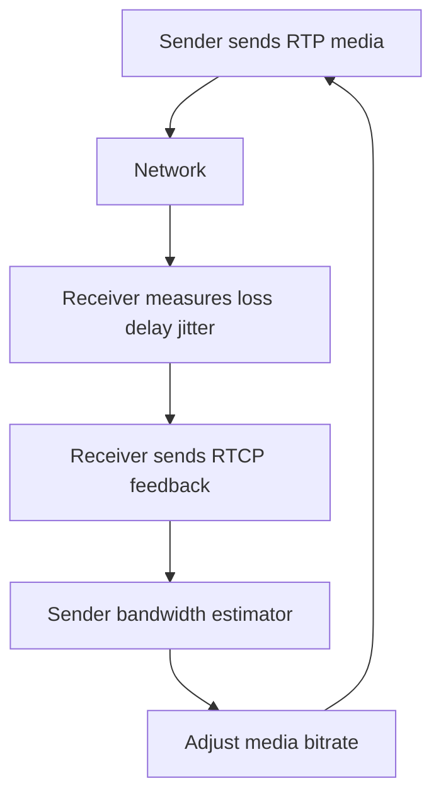

重點：

- 優點：能針對即時影音調整 bitrate，比單純 TCP retransmission 更適合低延遲互動。
- 缺點：偏 media transport，不適合直接拿來做一般 TCP echo server。
- 適合場景：視訊會議、直播、即時互動影音。
- 參考來源：[RFC 8834: Media Transport and Use of RTP in WebRTC](https://www.rfc-editor.org/info/rfc8834)、[RFC 8888: RTP Control Protocol Feedback for Congestion Control](https://www.rfc-editor.org/info/rfc8888)
