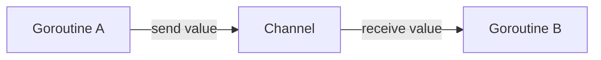
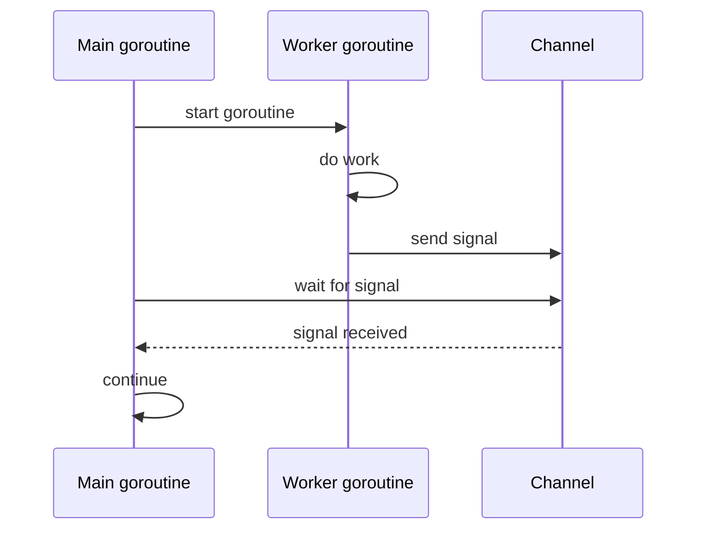
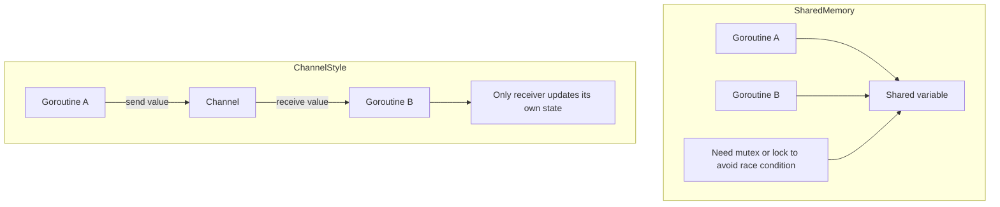
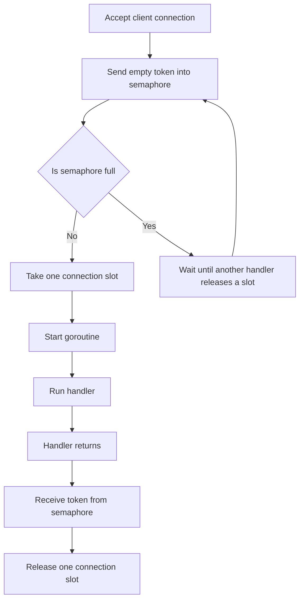

# Go Channel Arrow Syntax

`<-` 是 Go 的 channel operator，用來表示「資料在 channel 裡流動的方向」。它可以用在送資料、收資料、等待訊號，也可以用在 function 參數裡限制 channel 方向。

## 1. Send: `ch <- value`

```go
ch <- 10
```

意思是把 `10` 送進 `ch` 這個 channel。

可以用箭頭方向記：

```text
ch <- 10
```

箭頭指向 `ch`，所以是送進 channel。

## 2. Receive: `value := <-ch`

```go
value := <-ch
```

意思是從 `ch` 這個 channel 收一個值，然後存到 `value`。

可以用箭頭方向記：

```text
value := <-ch
```

箭頭從 `ch` 指出來，所以是從 channel 拿資料出來。

## 3. Wait Only: `<-done`

```go
<-done
```

這也是 receive，只是收到的值沒有存起來。

通常這種寫法不是為了拿資料，而是為了等待某個訊號。例如 context cancellation：

```go
done := ctx.Done()

<-done
listener.Close()
```

意思是：

```text
先卡住等待 done 發出訊號
等 context 被取消
done channel 被關閉
<-done 解除阻塞
繼續執行 listener.Close()
```

在 TCP server 裡，這常用來讓另一個 goroutine 等 shutdown 訊號，然後關掉 listener，讓原本卡在 `Accept()` 的主流程醒來。

## 4. Full Example

```go
package main

import "fmt"

func main() {
	ch := make(chan int)

	go func() {
		ch <- 10
	}()

	value := <-ch
	fmt.Println(value)
}
```

執行流程：

```text
main 建立 channel
goroutine 把 10 送進 channel
main 從 channel 收到 10
印出 10
```

## 5. Blocking Behavior

Channel 預設會 blocking。

對 unbuffered channel 來說：

```go
ch := make(chan int)
```

如果只有 send：

```go
ch <- 10
```

但沒有其他 goroutine 正在 receive，send 會卡住。

如果只有 receive：

```go
value := <-ch
```

但沒有其他 goroutine 正在 send，receive 也會卡住。

這就是 channel 可以拿來同步 goroutine 的原因。

## 6. Directional Channel

`<-` 也可以寫在 channel type 裡，限制 channel 的方向。

只能 receive：

```go
func readOnly(ch <-chan int) {
	value := <-ch
	fmt.Println(value)
}
```

只能 send：

```go
func writeOnly(ch chan<- int) {
	ch <- 10
}
```

可以 send 也可以 receive：

```go
func both(ch chan int) {
	ch <- 10
	value := <-ch
	fmt.Println(value)
}
```

## Quick Memory

```text
ch <- value     send value into channel
value := <-ch   receive value from channel
<-ch            wait for channel signal, ignore received value
<-chan T        receive-only channel
chan<- T        send-only channel
chan T          bidirectional channel
```

## 7. Why Go Needs Channels

Go has goroutines, which make it easy to run many tasks at the same time. Once many goroutines exist, they need a safe way to coordinate with each other. Channels exist for this reason: they let goroutines communicate by sending values or signals, instead of always sharing the same variable and protecting it with locks.

The Go documentation often summarizes this idea as:

```text
Do not communicate by sharing memory; share memory by communicating.
```

In simpler words:

```text
Instead of many goroutines touching the same data at the same time,
send the data or signal through a channel.
```

### Channel as Communication



In this model, `Goroutine A` does not need to directly modify a variable owned by `Goroutine B`. It sends a value into the channel, and `Goroutine B` receives it.

### Channel as Synchronization



Here the channel is not mainly used for data. It is used as a signal. The main goroutine waits at `<-ch` until the worker sends something.

### Shared Memory vs Channel



Both styles can be correct. The point is not that channels replace mutexes forever. The point is that channels are useful when the problem is naturally about passing work, passing ownership, waiting for completion, or limiting concurrency.

## 8. How This Applies to `lab0/tcp.go`

In `lab0/tcp.go`, the channel is used as a semaphore:

```go
sem := make(chan struct{}, maxConcurrentConnections)
```

This does not send meaningful data. It uses the channel buffer size to count how many client handlers are currently running.



So in this server:

```text
sem <- struct{}{} means take one slot.
<-sem means release one slot.
```

This is why Go channels are useful even when no real business data is being sent. They can also express control flow between goroutines.

## References

1. Go Blog, Share Memory By Communicating: <https://go.dev/blog/codelab-share>
2. Go Codewalk, Share Memory By Communicating: <https://go.dev/doc/codewalk/sharemem/>
3. Effective Go, Channels: <https://go.dev/doc/effective_go#channels>
4. Go Language Specification, Channel types: <https://go.dev/ref/spec#Channel_types>
