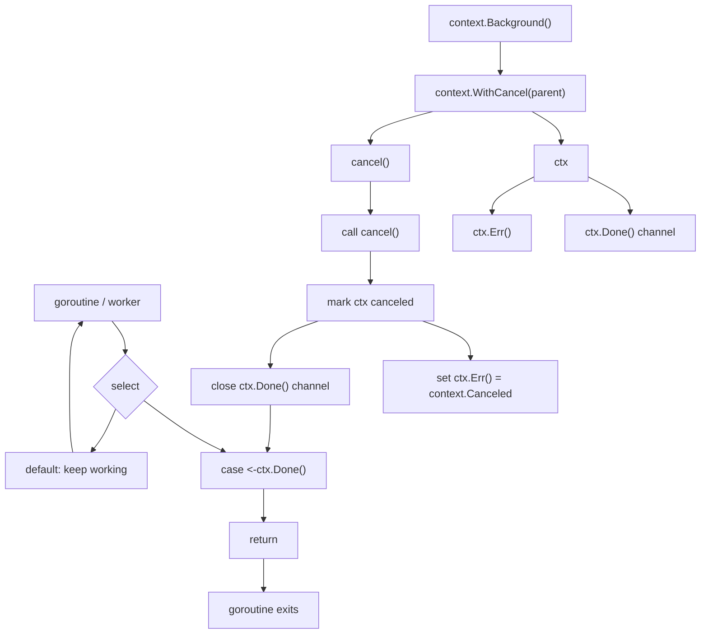
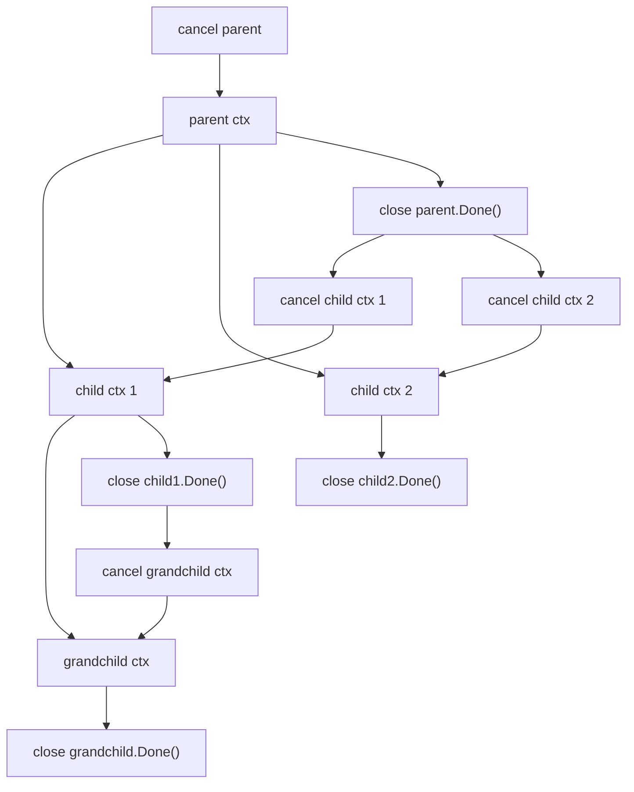

# Lab 1: Concurrent Programming in Go

## Introduction

In Lab 1, you will learn how to build concurrent program with Go.

## Goals of this lab

- Understand concurrent programming
- Understand the memory models in Go
- Learn How to use synchronization primitives in Go

## Race Condition & Critical Section

Race Condition is a situation where two or more goroutines access a shared resource concurrently, and at least one of the goroutines modifies the resource. This can lead to unexpected behavior, such as incorrect results or data corruption. As shown in the example below, You may not get 1000 as expected, but some smaller number depending on timing.

```go
package main

import (
    "fmt"
    "sync"
)

func main() {
    var counter int
    var wg sync.WaitGroup

    for i := 0; i < 1000; i++ {
        wg.Add(1)
        go func() {
            counter++
            wg.Done()
        }()
    }

    wg.Wait()
    fmt.Println(counter)
}
```

Critical Section is a section of code that accesses a shared resource and must be executed by only one goroutine at a time.

The Critical Section in the example listed above is:
```go
counter++
```

Because the `counter++` operation is not atomic or protected by a lock, multiple goroutines can access the shared resource concurrently.
Concurrent access will lead to the race condition.

## Goroutines

Goroutines are lightweight threads of execution that are managed by the Go runtime. Goroutines are used to perform concurrent operations in Go.

```go
package main

import (
    "fmt"
    "time"
)

func main() {
    go func() {
        fmt.Println("Hello, World!")
    }()

    time.Sleep(1 * time.Second)
}
```

## Atomic Operations

In Go, atomic operations are operations that are guaranteed to be executed as a single operation without interruption. This is important in concurrent programming because it ensures that the operation is executed in a consistent state.

In fact, atomic operations are achieved by atomic instructions, provided by the hardware. These instructions are used to perform operations on shared memory in a way that is guaranteed to be atomic.

- [[University of Washington CSE378] Atomic Operations](https://courses.cs.washington.edu/courses/cse378/07au/lectures/L25-Atomic-Operations.pdf)

```go
package main

import (
    "fmt"
    "sync/atomic"
)

func main() {
    var counter int32
    atomic.AddInt32(&counter, 1)
    fmt.Println(counter)
}
```

The example above demonstrates how to use atomic operations in Go. The `AddInt32` function is an atomic operation that increments the value of the counter by 1.

An atomic operation means the operation is completed as one indivisible step. Other goroutines cannot observe or interrupt the operation halfway through.

For example, this statement looks like one operation:
```go
counter++
```

However, it is usually closer to these steps:
```text
read counter
add 1
write counter back
```

If two goroutines execute these steps at the same time, they may both read the same old value and write back the same new value. This means one increment is lost.

Atomic operations prevent this kind of lost update for small shared-memory operations:
```go
atomic.AddInt64(&counter, 1)
```

Atomic operations are useful for simple operations such as increment, load, store, swap, and compare-and-swap. For larger critical sections, use synchronization primitives such as `sync.Mutex`.

## SpinLock

Spinlock is a synchronization primitive that is used to protect shared resources from concurrent access. A spinlock is used to ensure that only one goroutine can access the shared resource at a time.

Golang doesn't provide a built-in spinlock, but you can implement it using atomic operations.

```go
package main

import (
    "fmt"
    "sync/atomic"
)

type SpinLock struct {
    flag int32
}

func (s *SpinLock) Lock() {
    for !atomic.CompareAndSwapInt32(&s.flag, 0, 1) {
        // Spin until the lock is acquired
    }
}

func (s *SpinLock) Unlock() {
    atomic.StoreInt32(&s.flag, 0)
}
```

## Mutex

In Go, a mutex is a synchronization primitive that is used to protect shared resources from concurrent access. A mutex is used to ensure that only one goroutine can access the shared resource at a time.

The difference between a mutex and a spinlock is that a mutex will put the goroutine to sleep if the resource is already locked, while a spinlock will keep the goroutine busy until the resource is available.

In other words, both spinlock and mutex are locks. The main difference is how they wait when the lock is already held:

```text
Spinlock: keep checking until the lock is available
Mutex:    block or sleep until the lock is available
```

A spinlock may be useful only when the critical section is extremely short and the expected waiting time is very small. If the wait is long, a spinlock wastes CPU because it keeps running while waiting.

A mutex is the better default choice in Go. It lets the runtime block the waiting goroutine and schedule other useful work.

```go
package main

import (
    "fmt"
    "sync"
)

func main() {
    var counter int
    var mu sync.Mutex

    mu.Lock()
    counter++
    mu.Unlock()

    fmt.Println(counter)
}
```

Any other goroutine that tries to access the shared resource while the mutex is locked will be blocked until the mutex is unlocked.

- [Source Code of Mutex in Go](https://go.dev/src/sync/mutex.go)

## Semaphore

A semaphore is also a synchronization primitive, but it is used to control how many goroutines can access a resource at the same time.

The difference is:

```text
Mutex / Spinlock: allow 1 goroutine at a time
Semaphore:        allow N goroutines at a time
```

For example, a semaphore can limit:

- At most 5 goroutines sending API requests at the same time
- At most 10 workers processing jobs at the same time
- At most 3 connections using an expensive resource at the same time

In Go, a buffered channel can be used as a simple semaphore:

```go
package main

import "fmt"

func main() {
    sem := make(chan struct{}, 3) // allow at most 3 goroutines at once

    for i := 0; i < 10; i++ {
        go func(id int) {
            sem <- struct{}{}        // acquire one slot
            defer func() { <-sem }() // release one slot

            fmt.Println("worker", id)
        }(i)
    }
}
```

A binary semaphore, whose capacity is 1, can look similar to a mutex. However, their meanings are different. A mutex usually protects ownership of shared data. A semaphore usually represents a limited number of available resource slots.

## Channel
Goroutines run in the same address space, so access to shared memory must be synchronized. In Golang, Channel is a powerful concurrency primitive function used for passing data between different goroutines. It provides an effective communication mechanism that allows goroutines to safely exchange information without requiring additional synchronization mechanisms.

To create a channel, you can use Golang's built-in **`make`** function to establish an integer-type channel. Once successfully created, you can send data to the channel and receive data in another goroutine.

Channels can be used to receive and send data through the **`<-`** operator:
```go
var c chan int

ch := make(chan int)
cs := make(chan string)
cf := make(chan interface{})

ch <- v    // transmit v to channel ch
v := <-ch  // receive data from channel 'ch'，and asign value to v

close(ch) //close Channel
```

You can also read a channel with iteration (**`for range`**):
```go
func main() {
  ch := make(chan int)
  go func() {
    for i := 0; i < 10; i++ { //assign integers to ch
      ch <- i
    }
    close(ch)
  }()

  for v := range ch { //receive datas from ch iteratively
    fmt.Println(v)
  }
}
```

###  :dart: Unbuffered channel 
In fact, channels can be categorized into various types based on different characteristics. According to buffer capacity, channels can be divided into two types: **unbuffered channels** and **buffered channels**. 
When we used make to create a channel above, we did not assign it a capacity value. By default, the buffer capacity would be 0, making the created channel an **unbuffered channel**. Unbuffered channels perform both sending and receiving operations with blocking operation, i.e., if a function attempts to read from the channel (**`v := <-ch`**), it will be blocked until the channel receives data. Similarly, any send operation (**`ch <- i`**) will also be blocked until the data in the channel is read out.

Therefore, we can understand that unbuffered channels ensure that both read and write operations must synchronize before the program can proceed. As a result, this type of channel **does not require additional synchronization mechanisms**.
```go
func main() {
    c := make(chan bool)
    go func() {
        fmt.Println("free5GC so Good")
        c <- true
    }()
    <-c
}
```
In this example above, the main function ultimately uses **`<-c`**. Due to the "blocking" characteristic of unbuffered channels, the main function must wait until the goroutine sends a value before it terminates.

###  :dart: Buffered channel 
Buffered channels differ from unbuffered channels in that, as long as the buffer has sufficient capacity, the channel can continue receiving values without requiring them to be read immediately. This means that operations may not block right away,allowing producers and consumers to run more independently:
```go
func main() {
    c := make(chan bool, 1)  //Declare the capacity value (=1) of the buffer
    go func() {
        fmt.Println("free5GC so Good")
        c <- true
    }()
    <-c
} 
```
As shown in the example above, the goroutine will **still print** "free5GC so Good", and the main function will wait on <-c before it exits. Thus the output is guaranteed.

⚠️ However, if we remove the <-c (or any other waiting mechanism), the main function could terminate before the goroutine executes, and nothing would be printed. This is a common pitfall when using buffered channels.

### :dart: Unidirectional Channel
Channels is directional, categorized into **Bidirectional and Unidirectional**. **Unidirectional channels** only allow send or receive operations, and can be divided into **send-only channels** and **receive-only channels** furtherly. The characteristic of unidirectional data transmission provides higher security and readability in programs.

Previously, we created the most common Bidirectional channels by simply declaring the data type required by the channel or specifying the buffer capacity. When creating unidirectional channels, the **`<-`** operator is used to indicate the direction.
```go
func Thread(r <-chan int) {
    for {
        num := <-r
        fmt.Println("Thread : ", num)
        time.Sleep(time.Second)
    }
}

func main() {
    c := make(chan int, 3)
    s, r := (chan<- int)(c), (<-chan int)(c)
    go Thread(r)
    for i := 1; i <= 10; i++ {
        s <- i
    }
    for len(c) > 0 {
        time.Sleep(100)
    }
}
```
In this example, the main function creates a buffered channel **`c`**. The write-only end of this channel is assigned to **`s`**, and the read-only end is assigned to **`r`**. You can consider **`s`** and **`r`** as unidirectional channels. This design restricts goroutines from performing certain operations on the channel. For example, the **`Thread`** function does not have permission to write to **`r`**, but other goroutines can write to **`s`**, and consequently to **`c`**.
* [Understanding Go's onw-way channels](https://stackoverflow.com/questions/27642086/how-to-use-chan-and-chan-for-one-directional-communication)

## Select
In the previous sections, we learned how to create channels and categorize them. We understand that when a single channel performs a send or receive operation, it is a blocking operation. When a program involves multiple channels for communication, Golang provides the select statement for this purpose. It allows a goroutine to wait on multiple communication operations simultaneously. Its usage is similar to **`switch`**, relying on **`case`** and **`default`**.

**`select`** is in blocking operations; it starts execution only when a `case` is ready. Unlike **`switch`**, **`select`** doesn't execute cases **in order** but **randomly chooses** one from the ready cases (channels). There are several characteristics：
* **`select`** can only work with channels; using other types will result to error
* If a channel has no value to read, it causes a panic
* When none of the cases are ready, **`select`** executes the **`default`**. Notice that without a **`default`** case, select will be blocked if none of the cases are ready
```go
func main() {
    ch := make(chan int, 1)

    select {
    // case <-x means 從 channel x 接收一個值，但不把值存起來
    // 等價於 case _ = <-x 
    // 也就是只在乎 x 有沒有收到訊號，不在乎收到的值是什麼
    case <-ch:
        fmt.Println("random 01")
    case <-ch:
        fmt.Println("random 02")
    default:
        fmt.Println("exit")
    }
}
```
In the example above, due to **`ch`** does not have a value, none of the cases are ready, so the **`default`** case will be executed directly, then printing "exit".
### :tada: Setup Timeout mechanism
Sometimes, we encounter situations where a goroutine takes too long to execute or gets into blocking. In such cases, we don't want the entire program to be blocked within **`select`**. To handle this, we can setup **`timeout`** with **`select`**:
```go
func main() {
    timeout := make(chan bool, 1)
    go func() {
        time.Sleep(2 * time.Second)
        timeout <- true
    }()
    ch := make(chan int)
    select {
    case <-ch:
    case <-timeout:
        fmt.Println("Open5GS")
    case <-time.After(time.Second * 1): //Create a Read-Only Channel which will receive time.Time value
        fmt.Println("free5GC")
    }
}
```
In the example above, Once the **`select`** operation exceeds 1 second, and then it would print "free5GC".

## WaitGroup
Previously, you have learned about concurrency for goroutines, but how can you control the concurrency? One of the ways is through **`WaitGroup`**. When you have a task that you want to split it into different jobs for execution, you need to make the main goroutine waiting for the other goroutines being completed before continuing execution.

The reason we need a `WaitGroup` is that the main goroutine does not automatically wait for other goroutines.

For example:
```go
func main() {
    go func() {
        fmt.Println("job done")
    }()
}
```

This program may exit before the goroutine prints anything. When `main` returns, the whole process ends, and the background goroutine is stopped with it.

`sync.WaitGroup` solves this by keeping a counter of unfinished jobs:

```text
wg.Add(n):  add n jobs to wait for
wg.Done():  mark one job as finished, same as wg.Add(-1)
wg.Wait():  block until the counter becomes 0
```

Typically, you need to declare a WaitGroup with a **`pointer`**. There are 3 ways to declare it:
```go
wg := &sync.WaitGroup{}

wg := new(sync.WaitGroup)

var wg = &sync.WaitGroup{} //global declaration
```
After declaring it, you can use an integer to add tasks:
```go
func main() {
var wg sync.WaitGroup

    wg.Add(2)//integer means the amounts you have to wait
gofunc() {
        time.Sleep(2 * time.Second)
        fmt.Println("job 1 done.")
        wg.Done()
    }()
gofunc() {
        time.Sleep(1 * time.Second)
        fmt.Println("job 2 done.")
        wg.Done()
    }()
    wg.Wait() // make the main goroutine waiting other goroutines
    fmt.Println("All Done.")
}
```

:star: **Notice**: Every time you call **`wg.Add(int)`**, you must ensure that the number of times you call **`wg.Add()`**, there should be a corresponding **`wg.Done()`** when the wait group completes. Otherwise: 
* goroutines numbers > wg.Add numbers : some goroutines would not execute
* goroutines numbers < wg.Add numbers : cause Deadlock

Usually, call `wg.Add(1)` before starting the goroutine:

```go
for i := 0; i < 5; i++ {
    wg.Add(1)

    go func(id int) {
        defer wg.Done()
        fmt.Println("worker", id)
    }(i)
}

wg.Wait()
```

Do not put `wg.Add(1)` inside the goroutine. If `main` reaches `wg.Wait()` before the goroutine calls `Add(1)`, the counter may still be 0, and `main` may continue too early.
    
## Context
Context is another method to control concurrency. It can manage the termination of multiple goroutines and resources allocation. 
In the **WaitGroup** chapter, we introduced spliting a task into multiple jobs to run in the background. If you want to proactively notify and stop running jobs, you can achieve this with **`channel+select `** statements. However, if the situation is more complex, such as having a large number of background goroutines or goroutines within goroutines, you will need a more powerful tool.

`WaitGroup` and `Context` solve different problems:

```text
WaitGroup: wait for goroutines to finish
Context:   tell goroutines to stop
```

The most common uses of context are:

- Cancel a running operation
- Set a timeout or deadline
- Pass request-scoped values through a call chain


> Source: [小惡魔.AppleBOY](https://blog.wu-boy.com/2020/05/understant-golang-context-in-10-minutes/)

As shown in the diagram above, there are 3 worker nodes, each with many running jobs. We can declare **`context.Background()`** in the main program and create a separate **`context`** for each worker node. This way, closing one of the contexts will stop the jobs running in that worker.
```go
func main() {
    ctx, cancel := context.WithCancel(context.Background())

    go worker(ctx, "node01")
    go worker(ctx, "node02")
    go worker(ctx, "node03")

    time.Sleep(5 * time.Second) //stop the context (goroutine) after 5 seconds
    fmt.Println("stop the gorutine")
    cancel()
    time.Sleep(5 * time.Second) //canceling needs some time
}

func worker(ctx context.Context, name string) {
    for {
        select {
        case <-ctx.Done(): //ctx is canceled, from withCancel function
            fmt.Println(name, "got the stop channel")
            return
        default:
            fmt.Println(name, "still working")
            time.Sleep(1 * time.Second)
        }
    }
}
```
As above statement, you can stop multiple worker nodes with a single context simultaneously. You can also implement a graceful shutdown to cancel the running jobs through this approach.

The important part is:

```go
case <-ctx.Done():
```

`ctx.Done()` returns a channel. When `cancel()` is called, that channel is closed. In Go, receiving from a closed channel returns immediately, so the `case <-ctx.Done()` branch becomes ready and the goroutine can return.

Conceptually, `context.WithCancel` is similar to this pattern:

```go
done := make(chan struct{})

go func() {
    for {
        select {
        case <-done:
            fmt.Println("stop")
            return
        default:
            fmt.Println("working")
        }
    }
}()

close(done) // similar to calling cancel()
```

Calling `cancel()` does not forcibly kill a goroutine. It only sends a cancellation signal. The goroutine must check `ctx.Done()` and return by itself.

Internally, calling `cancel()` does several things:

```text
mark the context as canceled
set ctx.Err() to context.Canceled
close the ctx.Done() channel
cancel child contexts derived from this context
```

The relationship can be represented with Mermaid:



If a parent context is canceled, its child contexts are canceled too:



Of course, you can also declare multiple contexts and **`cancel`** functions, waiting for goroutines to complete their jobs with **`cancel`** and **`Done`**:
```go
func main() {
	ctx1, cancel1 := context.WithCancel(context.Background())
	ctx2, cancel2 := context.WithCancel(context.Background())

	go func() {
		task1()
		cancel1() //call cancel1 function
	}()

	go func() {
		task2()
		cancel2()
	}()
	
	<-ctx1.Done() //blocked until the context is canceled
	<-ctx2.Done()
	
	//-----------------
	// keep going down to execute
}

func task1() {
	fmt.Println("Starting job1")
	time.Sleep(3 * time.Second)
	fmt.Println("Finished job1")
}

func task2() {
	fmt.Println("Starting job2")
	time.Sleep(2 * time.Second)
	fmt.Println("Finished job2")
}
```

## Exercise
- What is atomic operation?
- Does the example below have concurrency issues? Why? 
```go
var a int64

func main() {
    var wg sync.WaitGroup
    wg.Add(1)
    
    go func() {
        increment()
        wg.Done()
    }()

    wg.Wait()

    fmt.Println("Final value of a:", a)
}

func increment() {
    for i := 0; i < 100000000; i++ {
        go func() {
             a = a + 1    
        }()
    }
}
```

- What do the **`wg.Add(1)`** and **`wg.Done()`** do in the above statement? And what does the **`1`** repersent?
- Please define a Counter struct with an integer field and a sync.Mutex, then implement a function to increment the counter safely.
- Why is there a fetal error in following code?
```go=
func main() {
    var intChan chan int
    fmt.Println(intChan)
    intChan <- 10
}
```
- In Topic: **Select**-**Setup Timeout mechanism**, We offered a sample code that showed how to setup **`timeout`** with **`select`**. Actually, there is a potentail error (Hint: memory leak) because of **`time.After`** usage. Please describe the reason for the error and how to fix it.

- You can reference the answer of this exercise at [ans/Answer.md](https://github.com/KunLee76/free5GCLab/blob/feat/lab1/lab1/ans/Answer.md)

## Reference
* [Uber_go_guide_tw](https://github.com/ianchen0119/uber_go_guide_tw)
