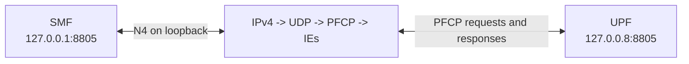
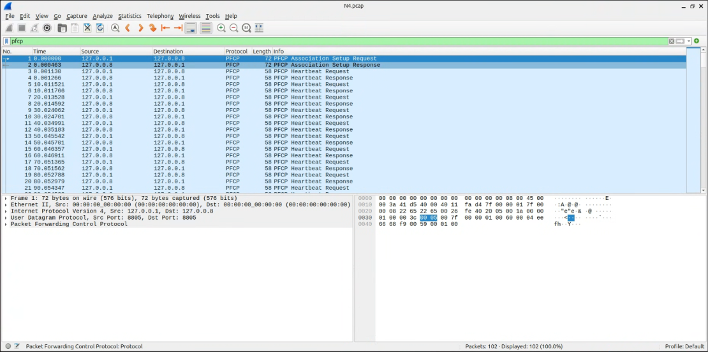
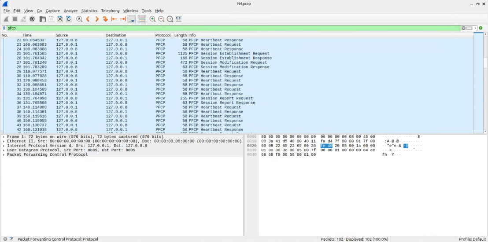
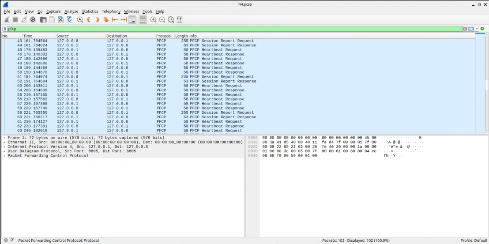

# Lab 5 Answers: N4 PFCP Observation

## Part 1: PFCP message types in order

The N4 endpoints in this lab are:

- SMF: `127.0.0.1:8805`
- UPF: `127.0.0.8:8805`

The meaningful PFCP procedure sequence is:

| Order | Direction | PFCP message type | Purpose |
| ---: | --- | --- | --- |
| 1 | SMF -> UPF | Association Setup Request | SMF asks to create a PFCP association with the UPF. |
| 2 | UPF -> SMF | Association Setup Response | UPF accepts the PFCP association. |
| 3 | SMF -> UPF | Session Establishment Request | SMF sends the initial rules for the UE PDU session to the UPF. |
| 4 | UPF -> SMF | Session Establishment Response | UPF confirms that the PFCP session and rules were created. |
| 5 | SMF -> UPF | Session Modification Request | SMF updates the forwarding rules after the access-side tunnel is known. |
| 6 | UPF -> SMF | Session Modification Response | UPF confirms the updated rules. |
| 7 | UPF -> SMF | Session Report Request | UPF reports a session event to the SMF. |
| 8 | SMF -> UPF | Session Report Response | SMF acknowledges the report. |
| 9 | SMF -> UPF | Session Deletion Request | SMF asks the UPF to remove the UE session during shutdown or release. |
| 10 | UPF -> SMF | Session Deletion Response | UPF confirms that the UE session was removed. |

PFCP **Heartbeat Request** and **Heartbeat Response** packets also appear
repeatedly between these procedures. They verify that the SMF-UPF association
is still alive. The number of heartbeat pairs depends on how long the capture
runs, so they do not occur only once in the sequence.

In the first N4 capture, the important packet positions were:

- Frames 1-2: Association Setup Request and Response
- Frames 3-24: repeated Heartbeat Request and Response pairs
- Frames 25-26: Session Establishment Request and Response
- Frames 27-28: Session Modification Request and Response
- Frames 35-36 and later every 30 seconds: Session Report Request and Response

That capture was stopped before PacketRusher and free5GC were shut down, so it
did not contain the Session Deletion Request and Response. A final capture must
continue until after UE shutdown to include them.

## Part 2: PFCP protocol stack

The protocol stack requested by the exercise is:

```text
UDP -> PFCP
```

This is proven by the Wireshark screenshots in the evidence section. In the
packet details panel, the selected N4 packet shows:

```text
User Datagram Protocol, Src Port: 8805, Dst Port: 8805
Packet Forwarding Control Protocol
```

That means PFCP is carried inside UDP. When all lower layers shown by
Wireshark are included, the full decoded packet stack is:

```text
Ethernet II capture header
  -> IPv4
     -> UDP
        -> PFCP
           -> PFCP Information Elements (IEs)
```

| Layer | Value in this lab | Role |
| --- | --- | --- |
| Link/capture layer | Ethernet II | Frame representation used by the loopback capture. |
| Network layer | IPv4, `127.0.0.1` <-> `127.0.0.8` | Identifies the SMF and UPF N4 endpoints. |
| Transport layer | UDP port `8805` | Carries connectionless PFCP messages. |
| Application layer | PFCP | Controls UPF association, session rules, reporting, and deletion. |
| PFCP payload | Information Elements | Contains items such as node IDs, F-SEIDs, PDRs, FARs, QERs, causes, and usage reports. |



PFCP is the N4 control-plane protocol. It does not carry the UE's Internet
payload. The SMF uses PFCP to tell the UPF how to detect, forward, police, and
report the UE's N3/N6 traffic.

## Sources and evidence

The exact packet order is an experimental result, so its primary source is
the capture itself rather than a standards document:






