# Lab 5 Notes: Local free5GC and PacketRusher Networking

## Initial loopback experiment: `127.0.0.8` and `127.0.0.18`

free5GC and PacketRusher initially ran in the same host network namespace.
Linux treats the entire `127.0.0.0/8` range as loopback, so `127.0.0.1`,
`127.0.0.8`, and `127.0.0.18` all refer to this VM. Traffic between these
addresses travels through the `lo` interface and does not leave the machine.

This layout was enough to test N2 registration, authentication, and PDU-session
creation. It did not provide a reliable N3 data path because free5GC and
PacketRusher both use `gtp5g` devices in the same network namespace. The
working layout later in this note isolates PacketRusher in `packetRusher_ns`.

The different addresses make the processes behave like separate network nodes:

| Component | Address | Purpose |
| --- | --- | --- |
| PacketRusher gNB | `127.0.0.1` | Simulated radio access network |
| SMF | `127.0.0.1` | Controls the UPF |
| UPF | `127.0.0.8` | Handles UE user traffic |
| AMF | `127.0.0.18` | Handles registration and signaling |

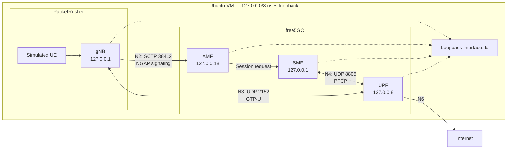

Separate addresses are especially important on N3. PacketRusher and the UPF
both listen on UDP port `2152`. They cannot normally bind the same IP address
and port at the same time.

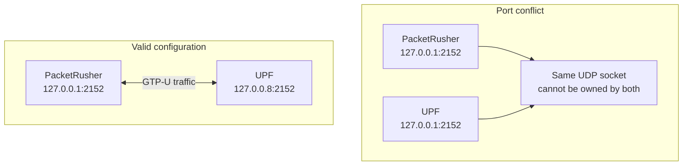

The exact numbers `.8` and `.18` are conventions in this free5GC
configuration. Other unused loopback addresses could work, but the two ends of
each connection must agree. A loopback address is reachable only inside its own
network namespace, so the final isolated topology uses routable addresses for
N2 and N3.

## Why use slice SD `010203`?

`010203` is a **Slice Differentiator (SD)**, not an IP address. A 5G network
slice is identified by an S-NSSAI:

```text
S-NSSAI = SST + SD
```

This lab uses:

```text
SST = 1
SD  = 010203
```

- The Slice/Service Type (SST) describes the general service type. SST `1`
  conventionally represents enhanced mobile broadband.
- The SD distinguishes this slice from other slices with the same SST.
- An SD is a 24-bit value. `010203` is six hexadecimal digits, or the three
  bytes `01 02 03`.

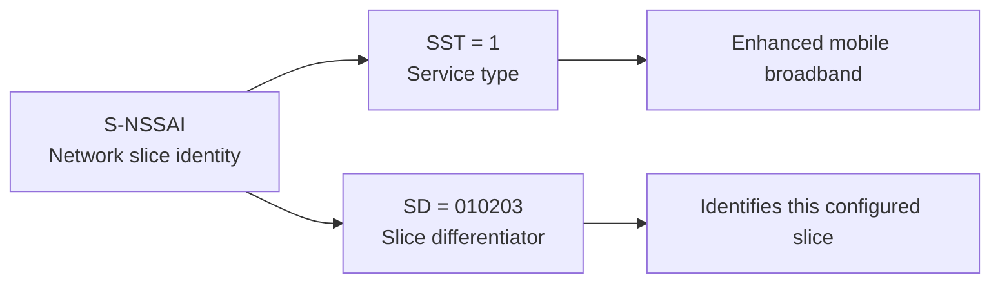

PacketRusher, free5GC, and the subscriber record must all refer to the same
slice:

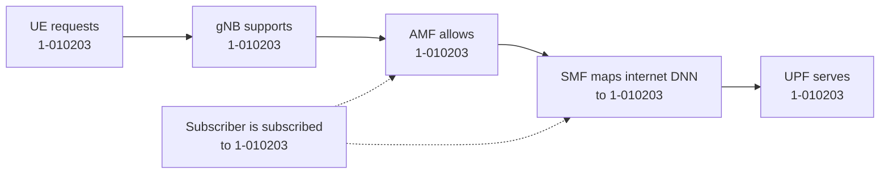

PacketRusher initially requested SD `000001`, while the current free5GC
configuration supports SD `010203`. With that mismatch, registration might
succeed but slice selection or PDU-session establishment can be rejected.

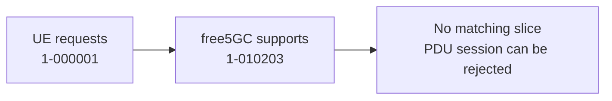

The value `010203` has no special universal meaning. Another valid 24-bit SD
would also work if the gNB, UE, AMF, SMF, UPF selection, and subscriber record
were all configured with that same value.

## Packet flow during the exercise

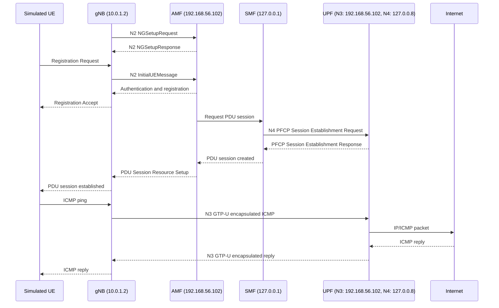

## Debugging the failed UE ping

The initial registration and PDU session succeeded, but this command returned
100% packet loss:

```bash
sudo ip vrf exec vrf0000000001 ping -c 5 8.8.8.8
```

Debugging should follow the packet one stage at a time instead of changing
several settings at once:

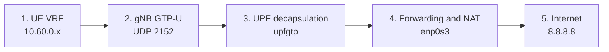

The checks produced these results:

| Stage | Result |
| --- | --- |
| UE interface and VRF default route | Present |
| PFCP session and UPF rules | Present |
| GTP-U packet from gNB to UPF | Present |
| Inner ICMP after UPF decapsulation | Present |
| IPv4 forwarding | Enabled |
| FORWARD firewall rule | Accepted the packets |
| Internet access from the VM itself | Working |
| Source NAT for inner UE packet | Not applied correctly |
| ICMP reply | Absent |

The decisive packet trace was:

```text
outer N3: 127.0.0.1:2152 -> 127.0.0.8:2152
inner UE: 10.60.0.2 -> 8.8.8.8
```

The inner packet reached `enp0s3`, but its private UE source address remained
`10.60.0.2`. An external router has no route back to that private PDU-session
subnet. The source should have been translated to the VM's N6 address.

### Private UE addresses and SNAT

`10.60.0.1` is a private IPv4 address. It belongs to the RFC 1918 range
`10.0.0.0/8`:

| Private IPv4 range | CIDR |
| --- | --- |
| `10.0.0.0` - `10.255.255.255` | `10.0.0.0/8` |
| `172.16.0.0` - `172.31.255.255` | `172.16.0.0/12` |
| `192.168.0.0` - `192.168.255.255` | `192.168.0.0/16` |

free5GC assigns UE addresses from the private PDU-session subnet
`10.60.0.0/16`. These addresses work inside the simulated 5G network, but the
public Internet does not have a route back to them.

SNAT means **Source Network Address Translation**. It is not a switch or a
separate physical device. It is a packet-rewriting function performed here by
the Linux kernel while acting as a router.

Without SNAT, the Internet-facing packet would be:

```text
Source:      10.60.0.1
Destination: 8.8.8.8
```

Even if the request reached `8.8.8.8`, the reply would be addressed to
`10.60.0.1`, for which the Internet has no return route.

SNAT replaces the private UE source with the address of the VM's outgoing
interface:

```text
Before SNAT: 10.60.0.1 -> 8.8.8.8
After SNAT:  10.0.2.15 -> 8.8.8.8
```

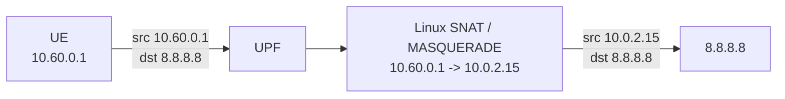

Linux keeps a connection-tracking entry for the translation. When the reply
arrives for `10.0.2.15`, Linux restores the original UE destination:

```text
Reply before reverse translation: 8.8.8.8 -> 10.0.2.15
Reply after reverse translation:  8.8.8.8 -> 10.60.0.1
```

The UPF can then encapsulate that reply in GTP-U and return it to the simulated
gNB and UE.

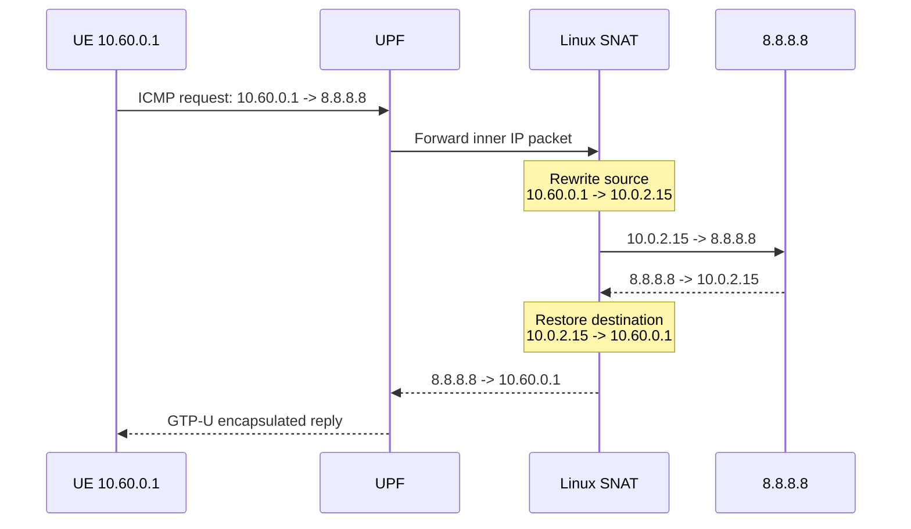

`MASQUERADE` is a form of SNAT that automatically uses the current address of
the outgoing interface:

```bash
sudo iptables -t nat -A POSTROUTING -o enp0s3 -j MASQUERADE
```

An explicit equivalent names the source subnet and replacement address:

```bash
sudo iptables -t nat -A POSTROUTING \
  -s 10.60.0.0/16 -o enp0s3 \
  -j SNAT --to-source 10.0.2.15
```

The lab can contain two NAT layers because `10.0.2.15` is also private:

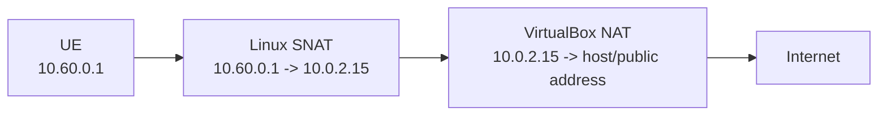

#### SNAT compared with a switch and router

| Function | Purpose |
| --- | --- |
| Switch | Forwards Ethernet frames using MAC addresses |
| Router | Forwards IP packets between networks |
| SNAT | Rewrites a packet's source IP address |
| DNAT | Rewrites a packet's destination IP address |
| Firewall | Allows or blocks packets according to rules |

A Linux machine can perform routing, NAT, and firewall functions at the same
time. In this lab, the VM routes UE packets and performs SNAT before forwarding
them toward the Internet:

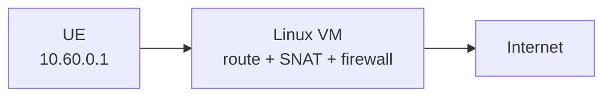

### Why two `gtp5g` users conflict in one network namespace

The problem is not that the `gtp5g` kernel module can only be used once.
PacketRusher and the UPF can both use the module, but they should have isolated
networking state. They use `gtp5g` for opposite ends of the N3 tunnel:

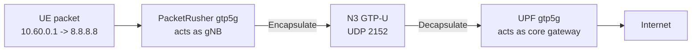

PacketRusher creates a device such as `val0000000001`, while the UPF creates
`upfgtp`. These have different names, but in one network namespace they still
share important kernel networking state:

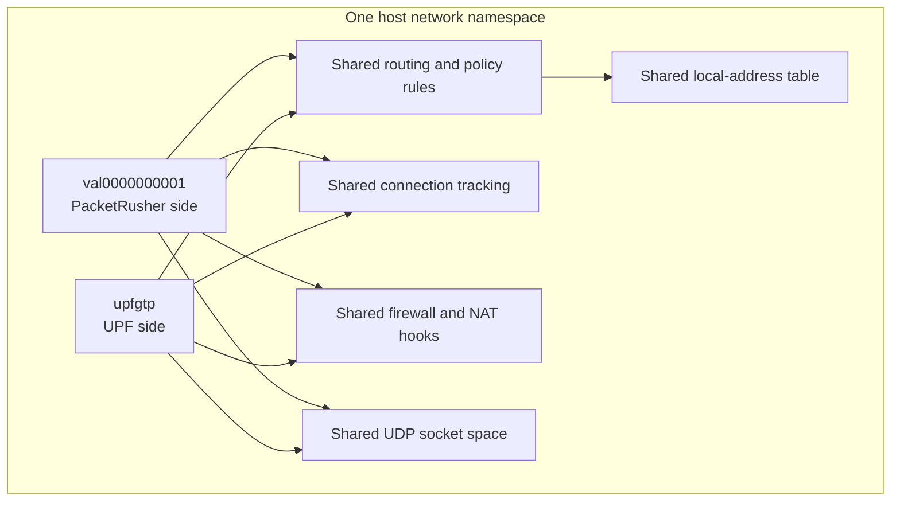

Both sides also install networking state for the UE subnet. The UPF installs a
route similar to:

```text
10.60.0.0/16 -> upfgtp
```

PacketRusher assigns a UE address to its device inside a VRF:

```text
10.60.0.1/32 -> val0000000001, VRF table 6
```

This places the simulated UE side and the core route back to that UE in one
Linux networking stack.

Using different loopback addresses prevents a direct UDP socket-binding
conflict:

```text
PacketRusher: 127.0.0.1:2152
UPF:          127.0.0.8:2152
```

It does not create a real network boundary. Linux sends the outer GTP-U packet
through `lo` and delivers it back into the same namespace:

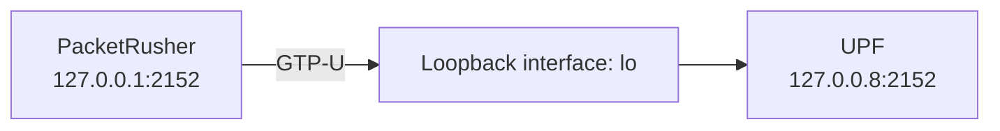

Consequently, the outer GTP-U packet, the decapsulated UE packet, both
`gtp5g` devices, routing, connection tracking, and NAT all interact in the
same stack. In this experiment, the uplink GTP-U packet was delivered and
decapsulated, but the inner packet did not receive the required source NAT:

```text
Observed after UPF processing: 10.60.0.2 -> 8.8.8.8
Required on N6:                 10.0.2.15 -> 8.8.8.8
```

The Internet therefore had no route for a reply to `10.60.0.2`. This behavior
is the reason the control plane and PDU-session setup could succeed while the
user-plane ping still failed.

### Why a network namespace fixes it

free5GC and PacketRusher both use the `gtp5g` kernel module. When both run in
the host network namespace, their network devices, routes, and packet-tracking
state can interfere. A Linux network namespace gives PacketRusher its own
interfaces, routing tables, VRF, and `gtp5g` device.

It also gives PacketRusher separate local addresses, UDP sockets, firewall
hooks, NAT rules, and connection-tracking state. The N3 packet crosses a veth
pair as actual traffic between network stacks instead of being short-circuited
through loopback:

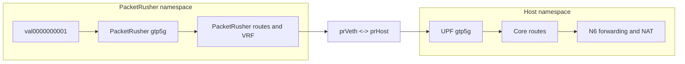

This resembles using separate PacketRusher and free5GC VMs: the gNB sends N3
from `10.0.1.2:2152`, the UPF receives it on `192.168.56.102:2152`, and the
decapsulated UE packet then follows the host's normal forwarding and N6 NAT
path.

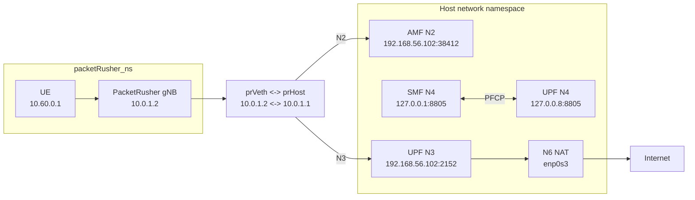

The working addresses are:

| Function | Address |
| --- | --- |
| PacketRusher gNB N2/N3 | `10.0.1.2` inside `packetRusher_ns` |
| Host end of veth pair | `10.0.1.1` on `prHost` |
| AMF N2 | `192.168.56.102:38412` |
| UPF N3 | `192.168.56.102:2152` |
| SMF N4 | `127.0.0.1:8805` |
| UPF N4 | `127.0.0.8:8805` |
| N6/Internet interface | `enp0s3` |

The UPF DNN entries use `natifname: enp0s3`, allowing UE addresses from
`10.60.0.0/16` to be translated for Internet access.

### What `prVeth` and `prHost` are

`prVeth` and `prHost` are the two ends of one Linux **virtual Ethernet
(`veth`) pair**. A veth pair behaves like a virtual Ethernet cable: a packet
sent through one end immediately appears at the other end. The interface names
are names chosen for this lab; they are not special Linux keywords.

- `prVeth` is inside `packetRusher_ns`. It owns `10.0.1.2/24`, so
  PacketRusher can use `10.0.1.2` for its N2 and N3 connections.
- `prHost` is in the host network namespace. It owns `10.0.1.1/24` and is the
  namespace's gateway toward free5GC and the rest of the network.
- Neither interface is a physical network card. Together they connect the
  isolated PacketRusher network stack to the host network stack.

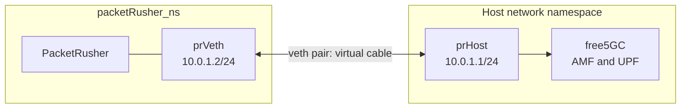

For example, an N2 signaling packet follows this path:

```text
PacketRusher
  -> prVeth (10.0.1.2)
  -> veth pair
  -> prHost (10.0.1.1)
  -> AMF (192.168.56.102:38412)
```

N3 GTP-U packets use the same veth pair but go to the UPF on UDP port `2152`.
Because both flows cross `prHost`, capturing on `prHost` shows the N2 and N3
traffic:

```bash
sudo tcpdump -i prHost -n 'sctp port 38412 or udp port 2152'
```

### Verifying the namespace and veth pair

Before running the lab, verify that the PacketRusher namespace exists:

```bash
ip netns list
```

Expected output:

```text
packetRusher_ns (id: 0)
```

This means:

- `packetRusher_ns` is the name of the network namespace that isolates
  PacketRusher from free5GC.
- `id: 0` is an internal namespace identifier assigned by the `ip` utility. It
  is not an IP address and does not need to match any configuration value.

Inspect the host end of the veth pair:

```bash
ip addr show prHost
```

Example output:

```text
12: prHost@if11: <BROADCAST,MULTICAST,UP,LOWER_UP> mtu 1500 ... state UP
    link/ether 2a:51:9b:9c:83:80 ... link-netns packetRusher_ns
    inet 10.0.1.1/24 scope global prHost
       valid_lft forever preferred_lft forever
    inet6 fe80::2851:9bff:fe9c:8380/64 scope link
       valid_lft forever preferred_lft forever
```

The fields have these meanings:

| Field | Meaning |
| --- | --- |
| `12:` | Interface index of `prHost` in the host namespace |
| `prHost@if11` | Host veth named `prHost`; its peer has interface index 11 in another namespace |
| `BROADCAST` | Interface supports broadcast frames |
| `MULTICAST` | Interface supports multicast frames |
| `UP` | Administratively enabled |
| `LOWER_UP` | The veth peer is connected and operational |
| `mtu 1500` | Maximum IP packet size before fragmentation is 1500 bytes |
| `state UP` | Interface is operational |
| `link/ether ...` | Automatically assigned MAC address of `prHost` |
| `link-netns packetRusher_ns` | The peer end of this veth is inside `packetRusher_ns` |
| `inet 10.0.1.1/24` | IPv4 address of the host end of the veth pair |
| `scope global` | Address can be used across the connected `10.0.1.0/24` network |
| `valid_lft forever` | Address does not expire automatically |
| `preferred_lft forever` | Address remains preferred for new connections |
| `inet6 fe80::.../64` | Automatically generated IPv6 link-local address |
| IPv6 `scope link` | IPv6 address is usable only on this veth link |

The `@if11` notation does not mean that `prHost` is attached to a physical
interface named `if11`. A veth pair behaves like a virtual Ethernet cable:

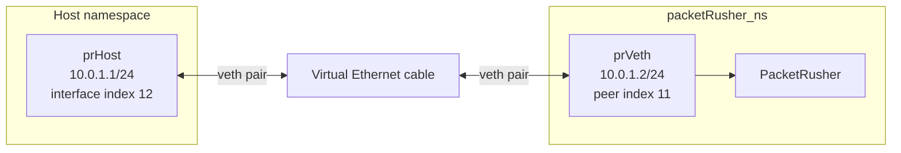

Packets transmitted through `prVeth` inside the namespace immediately appear
on `prHost` in the host namespace, and packets sent through `prHost` appear on
`prVeth`. This is why `prHost` is the correct interface for capturing N2 and N3
traffic in the single-VM namespace topology.

### Running the corrected topology

Start free5GC:

```bash
cd ~/free5gc
./run.sh
```

Capture N2 and N3 on the host end of the veth pair:

```bash
sudo tcpdump -i prHost -s 0 -w ~/N2N3.pcap \
  'sctp port 38412 or udp port 2152'
```

Capture N4 on loopback:

```bash
sudo tcpdump -i lo -s 0 -w ~/N4.pcap 'udp port 8805'
```

Start PacketRusher inside its namespace:

```bash
cd ~/PacketRusher
sudo ip netns exec packetRusher_ns ./packetrusher ue
```

This command was verified to work. The `ip netns exec packetRusher_ns` part
starts the PacketRusher process with the network view of `packetRusher_ns`.
The process can therefore bind its configured N2 and N3 address,
`10.0.1.2`, which belongs to `prVeth` inside that namespace.

Running only `sudo ./packetrusher ue` starts PacketRusher in the host network
namespace. The host owns `10.0.1.1` on `prHost`, but it does not own
`10.0.1.2`. When PacketRusher tries to use `10.0.1.2` as its local SCTP
address, Linux returns `cannot assign requested address`. Its automatic
retries with `10.0.1.3`, `10.0.1.4`, and later addresses fail for the same
reason because those addresses are not assigned either.

`ip netns exec` changes the process's network namespace; it does not move the
PacketRusher executable or change the current directory. PacketRusher still
reads `/home/ubuntu/PacketRusher/config/config.yml`, but it sees `prVeth`, the
namespace routing table, and the route through `10.0.1.1`.

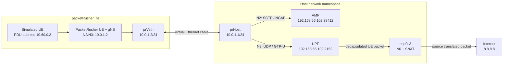

The N2 path carries signaling between the simulated gNB and AMF. The N3 path
carries the UE's user packet inside a GTP-U tunnel between PacketRusher and
the UPF. The UPF removes the GTP-U wrapper, and SNAT on the N6 path replaces
the private UE source address before the packet leaves through `enp0s3`.

Test the PDU-session data path from another terminal:

```bash
sudo ip netns exec packetRusher_ns \
  ip vrf exec vrf0000000001 ping -c 5 8.8.8.8
```

The verified result was five replies and 0% packet loss.

### Reusable debugging commands

```bash
# Namespace and veth
ip netns list
ip addr show prHost
sudo ip netns exec packetRusher_ns ip -br addr

# UE VRF and routing table
sudo ip netns exec packetRusher_ns ip link show type vrf
sudo ip netns exec packetRusher_ns ip route show table 6

# N2 and N3 packets
sudo tcpdump -ni prHost 'sctp port 38412 or udp port 2152'

# Inner packet after UPF decapsulation
sudo tcpdump -ni upfgtp icmp

# Packet leaving toward the Internet
sudo tcpdump -ni enp0s3 icmp

# Forwarding, firewall, and NAT
sysctl net.ipv4.ip_forward
sudo iptables -L FORWARD -n -v
sudo iptables -t nat -L POSTROUTING -n -v
```

The namespace and veth pair are runtime objects and normally disappear after a
reboot. The YAML configuration changes remain on disk, but the namespace must
be recreated before starting PacketRusher after reboot.
